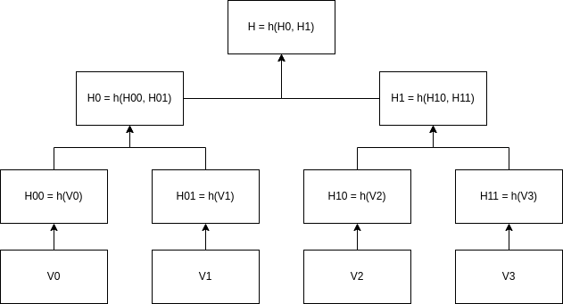

# Merkle Tree 

## Challenge description
Implement a Merkle Tree in Rust. Our Merkle Trees have a height >= 0. The height is the number of levels above the leaves. This means the simplest tree has height 0 and is just a single value hashed into a single leaf. Below you can find an example, where the Vx are the values stored into the Merkle Tree and h is some hash function:

A Merkle tree of height 2 would look like this:

The Merkle Opening of a value is the partners with which a given leaf is hashed to reconstruct the root. In the example above, the opening of H01 would be [H00, H1].

If a leaf has not been inserted into yet, the default value of a leaf is h(0).

### Requirements:

Your implementation should support the following operations: 

- Insert: Your implementation provides a way to insert a value into the tree. 
- Get Root: Your implementation provides a way to get the root of the tree at any given time.
- Get Value: Your implementation provides a way to fetch the a leaf (i.e. the hash of some value) stored at a provided index.
- *Optional:* Get Opening: Your implementation provides a way to fetch the opening of the leaf at a provided index.

### Additional Information:
- We do not know what *hash function* our Merkle Tree will use yet. Your implementation should be generic enough that we can easily adapt to using a different hash function without changing much code.
- We do not know what *height* our Merkle Tree will have yet. Your implementation should be generic enough, that we can easily adapt to using a different height without changing much code.
- Your implementation should run smoothly for height <= 10.
